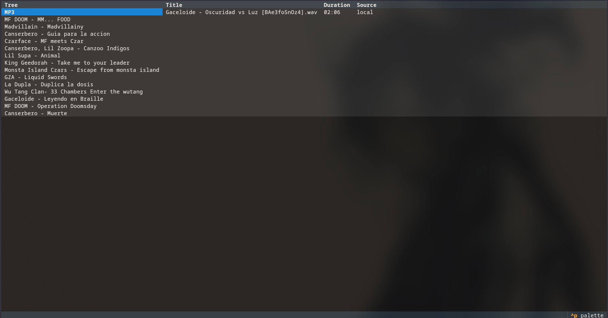
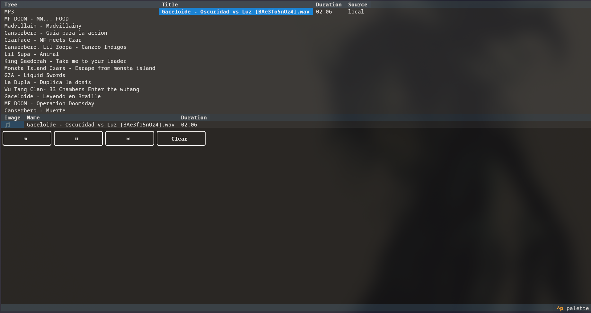

# Waving-CLI-Player
Waving CLI is a music player that plays local files and stream from YT

Waving is a music player based on [Textual](https://github.com/textualize/textual) for creating menus and on [miniaudio](https://github.com/irmen/pyminiaudio) to process audio files, supports wav, mp3 and ogg.

The player searches in /home/Music and, if the folder doesnt exist creates it.
If you dont have any files or folder here, you will be notified.

You can navigate through the menus using keyboard Arrows and Enter to select file or folder.

If you selected a folder, browse within this folder.

If selected a file, add it to a playlist; if you then want to select another file, that file will be placed next in the playlist.

This is the Project Status Diagram:

# LLTFS (LONG LIVE TO FREE SOFTWARE)
Thank you for run, study, redistribute and contribute!

Att: Calak de Astora